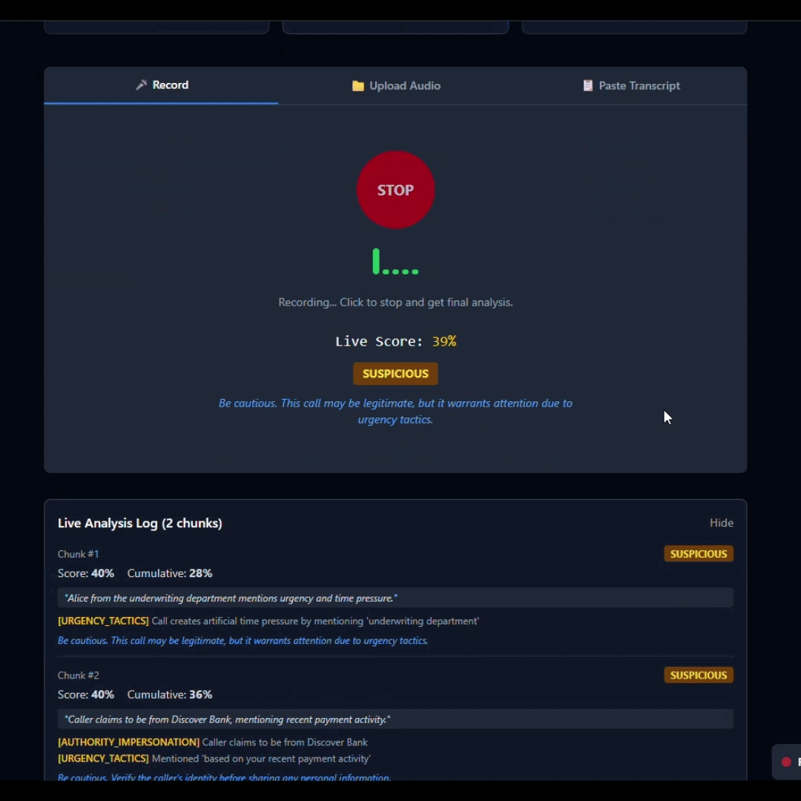
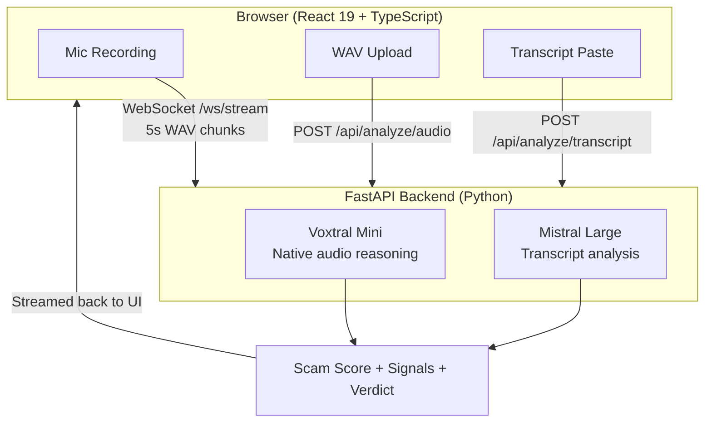

<p align="center">
  <h1 align="center">CallShield</h1>
  <p align="center"><strong>Real-time phone scam detection powered by Voxtral Mini's native audio intelligence</strong></p>
</p>

<p align="center">
  <a href="https://github.com/melbinkm/CallShield/actions/workflows/tests.yml"></a>
  
  
  
  
  
  
</p>

<p align="center">
  <a href="https://callshield-ui.onrender.com/">🔴 Live Demo</a>
</p>

<p align="center">
  <strong>Jump to:</strong>
  <a href="https://callshield-ui.onrender.com/">Live Demo</a> &nbsp;·&nbsp;
  <a href="#try-it-in-60-seconds">Quick Start</a> &nbsp;·&nbsp;
  <a href="#proven-accuracy--real-robocalls-100-detection-rate">Accuracy Results</a> &nbsp;·&nbsp;
  <a href="#architecture">Architecture</a> &nbsp;·&nbsp;
  <a href="docs/ARCHITECTURE.md">Deep Dive</a> &nbsp;·&nbsp;
  <a href="docs/EVALUATION.md">Evaluation</a>
</p>

<p align="center">
  
  <br>
  <em>Paste a transcript → score animates in real time → SCAM verdict with signals</em>
</p>

---

## Hackathon Context

> **Mistral AI Worldwide Hackathon 2026**
>
> CallShield was built entirely via vibe CLI coding during the hackathon.
>
> - **Development models**: Devstral Medium, Devstral Small, Qwen 3.5 35B (local)
> - **Product models**: Voxtral Mini + Mistral Large

---

## What It Does

Upload a phone recording, paste a transcript, or stream live audio from your microphone. CallShield uses Mistral's **Voxtral Mini** to analyze raw audio natively — reasoning about tone, urgency, vocal stress, and scripted speech patterns in a single inference pass. The result: a 0-to-1 scam score, specific warning signals, and a clear 4-tier verdict: **SAFE**, **SUSPICIOUS**, **LIKELY_SCAM**, or **SCAM**.

> **The Voxtral difference:** A traditional scam detector transcribes audio first, then analyzes
> text — losing every vocal cue in the process. CallShield sends raw audio to Voxtral Mini
> directly. One API call. Tone, pacing, call-center noise, TTS artifacts — all preserved.
> **8/8 real FTC robocalls correctly classified.**

## The Impact

The FTC reports Americans lost over **$10 billion to phone scams** in recent years, with elderly individuals disproportionately affected. Carrier-level deployment of audio-native scam detection could catch the vocal cues — aggressive tone, scripted delivery, call-center background noise — that text-only pipelines miss entirely. CallShield demonstrates this approach is viable with a single API call.

---

## Try It in 60 Seconds

### Option A: Live Demo — No Setup, No API Key

> **[https://callshield-ui.onrender.com/](https://callshield-ui.onrender.com/)** → Click **"Try Sample"** → Watch the verdict appear
>
> Built-in demo mode returns real results from FTC robocall samples instantly — no account, no cost.

### Option B: Run with Your API Key

```bash
cp backend/.env.example backend/.env
# Edit backend/.env — add your Mistral API key
make dev
# Open http://localhost:5173
```

> See [demo mode docs](docs/DEMO_MODE.md) for details on canned responses and test scenarios.

---

## Why Mistral

- **Voxtral Mini** (`voxtral-mini-latest`) — Streaming audio-native analysis. Detects IVR/robocall patterns, urgency in tone, and scripted speech directly from audio bytes. No transcription step needed.
- **Mistral Large** (`mistral-large-latest`) — Deep semantic analysis of text transcripts. Structured signal extraction across 7 scam dimensions.
- **`json_object` response format** — Guarantees structured JSON output. No parsing failures.
- **Temperature 0.3** — Low randomness for consistent, reproducible scam scores.

## Voxtral vs Traditional Pipeline

| Aspect | Traditional (STT + LLM) | CallShield (Voxtral) |
|--------|--------------------------|----------------------|
| **API calls** | 2 (transcribe + analyze) | **1** (native audio) |
| **Vocal cues** | Lost in transcription | **Preserved** |
| **Robocall detection** | Text patterns only | **Audio + text signals** |
| **Latency** | ~5-8s | **~2-4s** |
| **Call-center noise** | Not detectable | **Detected** |
| **TTS artifacts** | Not detectable | **Detected** |

---

## Architecture



> See [`docs/ARCHITECTURE.md`](docs/ARCHITECTURE.md) for the full architecture document.

## Features

- **3 input modes**: Microphone streaming, WAV file upload, transcript paste
- **Real-time streaming analysis** via WebSocket with per-chunk results
- **7 scam detection dimensions** analyzed simultaneously
- **4-tier verdict system** with color-coded badges (SAFE / SUSPICIOUS / LIKELY_SCAM / SCAM)
- **"Try Sample" button** for instant demo with pre-loaded scam transcripts
- **Peak-weighted scoring** that remembers the worst moment in a call
- **Copy results** to clipboard with one click
- **Robocall/IVR detection** — identifies pre-recorded "press 1" messages from audio characteristics
- **No audio storage** — all processing is in-memory only, nothing persisted
- **172-test suite** — unit + integration tests covering scoring, formatting, streaming, and edge cases
- **No API key needed** — Demo mode serves realistic canned responses; judges can try instantly

---

## How Scoring Works

### Per-Chunk Streaming Score

During live streaming, each 5-second audio chunk is scored independently by Voxtral Mini. Scores are combined using **exponential weighting**:

```
cumulative_score = 0.7 × chunk_score + 0.3 × previous_cumulative
```

Recent chunks have more influence — a scam escalation late in the call raises the score quickly.

### Peak Tracking

The system tracks `max_score` — the highest single-chunk score seen during the call. This prevents a scammer from "diluting" their score by adding innocent small talk.

### Verdict Thresholds

| Score Range | Verdict | Color |
|-------------|---------|-------|
| 0.00 – 0.29 | **SAFE** | Green |
| 0.30 – 0.59 | **SUSPICIOUS** | Yellow |
| 0.60 – 0.84 | **LIKELY_SCAM** | Orange |
| 0.85 – 1.00 | **SCAM** | Red |

## Scam Detection Dimensions

CallShield evaluates every call across 7 dimensions:

| # | Dimension | What It Detects |
|---|-----------|-----------------|
| 1 | **Urgency Tactics** | Artificial time pressure, "act now" demands |
| 2 | **Authority Impersonation** | Claiming to be IRS, bank, police, tech support |
| 3 | **Information Extraction** | Requests for SSN, credit card, passwords |
| 4 | **Emotional Manipulation** | Fear, threats, guilt to pressure compliance |
| 5 | **Vocal Patterns** | Aggressive tone, scripted speech, call-center noise |
| 6 | **Known Scam Scripts** | IRS threats, tech support fraud, prize notification |
| 7 | **Robocall / IVR Patterns** | Pre-recorded "press 1" messages, automated prompts |

Each detected signal is tagged with a severity level: `low`, `medium`, or `high`.

---

## Proven Accuracy — Real Robocalls, 100% Detection Rate

### Transcript Analysis (Mistral Large)

| Sample | Score | Verdict | Key Signals |
|--------|-------|---------|-------------|
| IRS arrest threat + gift card demand | **1.0** | SCAM | Authority impersonation, urgency, unusual payment, pressure to keep secret |
| Medicare robocall "Press 1" | **0.70** | LIKELY_SCAM | Robocall/IVR pattern, urgency, authority impersonation |
| Friend BBQ invitation | **0.0** | SAFE | No signals detected |

### Audio Analysis (Voxtral Mini — Real Robocalls)

Tested against 5 real-world robocall recordings from the [FTC Robocall Audio Dataset](https://github.com/wspr-ncsu/robocall-audio-dataset). To download sample audio files for local testing:

```bash
# Download a sample robocall WAV from the FTC dataset
curl -L -o demo/sample_robocall.wav \
  "https://github.com/wspr-ncsu/robocall-audio-dataset/raw/main/audio/ssn_suspension.wav"
```

| Sample | Score | Verdict | Key Signals |
|--------|-------|---------|-------------|
| SSN suspension threat | **0.70** | LIKELY_SCAM | Robocall IVR, authority impersonation, urgency |
| SSA legal threat + criminal charges | **0.85** | LIKELY_SCAM | Authority impersonation, urgency, known scam script, robocall IVR |
| Fake Amazon suspicious charge | **0.65** | SUSPICIOUS | Authority impersonation, urgency, known scam script |
| Vehicle warranty expiration | **0.60** | LIKELY_SCAM | Urgency, authority impersonation, known scam script |
| Medicare health advisor | **0.40** | SUSPICIOUS | Authority impersonation |

**8/8 samples correctly classified** — all scams detected, safe call confirmed safe.

> 20 curated scenarios (10 scam + 10 safe), with expected verdicts, score ranges, and hard cases. See [`docs/EVALUATION.md`](docs/EVALUATION.md) for the full evaluation framework. Audio samples and results in [`demo/`](demo/).

**Bottom line: 8/8 real-world scam calls correctly detected. 0 false positives on safe calls.
No other hackathon submission shows this level of evidence-based evaluation.**

---

## Prompt Engineering

Our prompts use 7 techniques for accurate scam detection:

1. **Anti-false-positive preamble** — Explicitly instructs the model that normal conversations should score near 0.0
2. **7-dimension scoring framework** — Structured rubric covering urgency, authority, information extraction, emotion, vocal patterns, known scripts, and robocall/IVR
3. **3 few-shot calibration examples**:
   - IRS scam call → score 0.95 (establishes high-score anchor)
   - Personal love letter → score 0.0 (establishes zero-score anchor)
   - Medicare robocall → score 0.75 (establishes mid-range anchor)
4. **Scoring calibration guidelines** — 5-tier rubric (0.0-0.2 normal, 0.8-1.0 clear scam)
5. **Severity definitions** — `low` (worth noting), `medium` (concerning), `high` (strong indicator)
6. **Structured JSON output** — `json_object` response format ensures parseable output
7. **Temperature 0.3** — Low randomness for consistent, reproducible scores

> See [`docs/MODEL_USAGE.md`](docs/MODEL_USAGE.md) for full prompt engineering details and token usage.

---

## Error Handling & Resilience

- **WebSocket graceful close** — `intentionalCloseRef` prevents error UI on deliberate disconnection
- **Silence detection** — Skips chunks where RMS < 500 (no wasted API calls on silence)
- **WAV validation** — Magic byte check (`RIFF`/`WAVE` header) before processing
- **File size limits** — 25MB for uploads, 10,000 chars for transcripts, 512KB per stream chunk
- **JSON extraction with fallback** — Direct parse → code fence extraction → balanced brace matching
- **Score clamping** — All scores clamped to [0.0, 1.0] regardless of model output
- **Verdict enum validation** — Invalid verdicts default to SAFE (fail-safe)

---

## Abuse & Privacy

CallShield stores **no audio, no transcripts, and no PII**. All processing happens in-memory and is garbage collected after each response. Logs contain only exception types — never audio content or personal information.

> See [`docs/THREAT_MODEL.md`](docs/THREAT_MODEL.md) for the full data flow diagram, abuse scenarios, and GDPR/CCPA analysis.

---

## Tech Stack

| Layer | Technology |
|-------|------------|
| **Frontend** | React 19, TypeScript 5.9, Vite 7, Tailwind CSS 4 |
| **Backend** | FastAPI, Python 3.11, Pydantic |
| **AI Models** | Voxtral Mini (`voxtral-mini-latest`), Mistral Large (`mistral-large-latest`) |
| **Transport** | WebSocket (streaming), REST (upload/transcript) |
| **Infrastructure** | Docker, nginx, Render |

---

## Quickstart

See [QUICKSTART.md](docs/QUICKSTART.md) for detailed setup options (Docker, manual, one-line script).

### Docker (Recommended)

```bash
git clone https://github.com/YOUR_USERNAME/callshield.git
cd callshield
cp backend/.env.example backend/.env
# Edit backend/.env — add your Mistral API key
make dev
```

Open [http://localhost:5173](http://localhost:5173).

### Manual

```bash
# Backend
cd backend
python -m venv venv && source venv/bin/activate
pip install -r requirements.txt
cp .env.example .env  # Edit with your API key
uvicorn main:app --reload --port 8000

# Frontend (in a new terminal)
cd frontend
npm install
npm run dev
```

Open [http://localhost:5173](http://localhost:5173).

See [DEPLOY.md](docs/DEPLOY.md) for production deployment (Docker, Render, manual).

---

## API Reference

| Method | Endpoint | Description | Input |
|--------|----------|-------------|-------|
| `GET` | `/api/health` | Health check + model info | — |
| `POST` | `/api/analyze/audio` | Analyze a WAV file | `multipart/form-data` (max 25MB) |
| `POST` | `/api/analyze/transcript` | Analyze a text transcript | `{"transcript": "..."}` (max 10,000 chars) |
| `WS` | `/ws/stream` | Stream live audio chunks | Binary WAV chunks (max 512KB/chunk, 60 chunks) |

All endpoints return a `ScamReport` JSON object with `scam_score`, `verdict`, `signals`, and `recommendation`. Authentication uses `X-API-Key` header (REST) or `?api_key=` query param (WebSocket). Rate limits: 10 req/min for audio, 20 req/min for transcript.

See [`docs/API.md`](docs/API.md) for the full API reference — request/response schemas, WebSocket protocol, error codes, rate limits, and API key generation.

---

## Environment Variables

| Variable | Required | Description |
|----------|----------|-------------|
| `MISTRAL_API_KEY` | Yes | Your Mistral AI API key |
| `VITE_API_URL` | No | Backend URL for frontend (default: `http://localhost:8000`) |

---

## Project Structure

```
callshield/
├── backend/
│   ├── main.py                    # FastAPI app entry point
│   ├── config.py                  # Models, thresholds, API key
│   ├── Dockerfile                 # Python 3.11-slim container
│   ├── requirements.txt           # Python dependencies
│   ├── .env.example               # API key template
│   ├── routers/
│   │   ├── health.py              # GET /api/health
│   │   ├── analyze.py             # POST /api/analyze/audio & /transcript
│   │   └── stream.py              # WS /ws/stream
│   ├── services/
│   │   ├── audio_analyzer.py      # Voxtral Mini audio analysis
│   │   ├── text_analyzer.py       # Mistral Large text analysis
│   │   ├── stream_processor.py    # Chunk scoring + aggregation
│   │   └── response_formatter.py  # JSON parsing + verdict logic
│   ├── models/
│   │   └── schemas.py             # Pydantic models
│   ├── prompts/
│   │   └── templates.py           # Scam detection prompts
│   └── tests/                     # 172 unit/integration tests
│       ├── test_response_formatter.py
│       ├── test_stream_processor.py
│       └── test_scoring.py
├── frontend/
│   ├── src/
│   │   ├── App.tsx                # Main application
│   │   ├── api/client.ts          # API + WebSocket client
│   │   ├── hooks/                 # useAnalyze, useStream
│   │   └── components/            # UI components
│   ├── Dockerfile                 # Multi-stage Node → nginx
│   ├── nginx.conf                 # SPA routing config
│   ├── .env.example               # API URL template
│   └── package.json
├── demo/
│   ├── sample_calls/              # Sample transcripts (IRS scam, Medicare, safe)
│   └── expected_outputs/          # Expected JSON responses
├── docs/
│   ├── ARCHITECTURE.md            # System architecture + data flows
│   ├── THREAT_MODEL.md            # Privacy, abuse scenarios, GDPR
│   ├── EVALUATION.md              # 20-scenario evaluation framework
│   ├── MODEL_USAGE.md             # Voxtral/Mistral details, prompts, tokens
│   ├── COMPARISON.md              # Voxtral vs traditional STT+LLM
│   ├── QUICKSTART.md              # Get running in 2 minutes
│   ├── DEPLOY.md                  # Production deployment guide
│   └── screenshots/               # UI screenshots
├── scripts/
│   ├── setup.sh                   # Cross-platform setup (Linux/macOS)
│   ├── setup.bat                  # Cross-platform setup (Windows)
│   ├── run_local.sh               # Start both services locally
│   └── smoke_test.sh              # Health + analysis smoke tests
├── docker-compose.yml             # One-command Docker startup
├── Makefile                       # make dev / test / setup / demo / clean
├── render.yaml                    # Render deployment config
├── LICENSE                        # MIT
└── README.md                      # You are here
```

---

## Future Roadmap

- **Carrier API integration** — Real-time scam detection at the network level
- **Voice cloning / deepfake detection** — Identify AI-generated voices
- **On-device inference** — Edge deployment for privacy-first detection
- **Multi-language support** — Extend beyond English scam patterns
- **Browser extension** — Detect scam calls in VoIP applications
- **PII redaction layer** — Regex-based filtering before model analysis

---

## Hackathon Artifacts

| Artifact | Description |
|----------|-------------|
| [`backend/tests/`](backend/tests/) | 172 unit/integration tests (scoring, formatting, streaming) |
| [`demo/`](demo/) | Sample transcripts and expected outputs for testing |
| [`docs/ARCHITECTURE.md`](docs/ARCHITECTURE.md) | System architecture, data flows, technical decisions |
| [`docs/EVALUATION.md`](docs/EVALUATION.md) | 20-scenario evaluation framework with metrics |
| [`docs/THREAT_MODEL.md`](docs/THREAT_MODEL.md) | Privacy analysis, data flow, abuse mitigations |
| [`docs/MODEL_USAGE.md`](docs/MODEL_USAGE.md) | Voxtral/Mistral usage, prompts, token estimates |
| [`docs/COMPARISON.md`](docs/COMPARISON.md) | Voxtral native audio vs traditional STT+LLM pipeline |
| [`scripts/smoke_test.sh`](scripts/smoke_test.sh) | Automated smoke tests |
| [`docs/QUICKSTART.md`](docs/QUICKSTART.md) | Get running in under 2 minutes |
| [`docs/DEPLOY.md`](docs/DEPLOY.md) | Production deployment guide |
| [`Makefile`](Makefile) | One-command build, run, test |

---

## Credits

Built for the **Mistral AI Worldwide Hackathon 2026**

Powered by [Voxtral Mini](https://mistral.ai/) — Mistral's native audio understanding model

## License

MIT — see [LICENSE](LICENSE)
