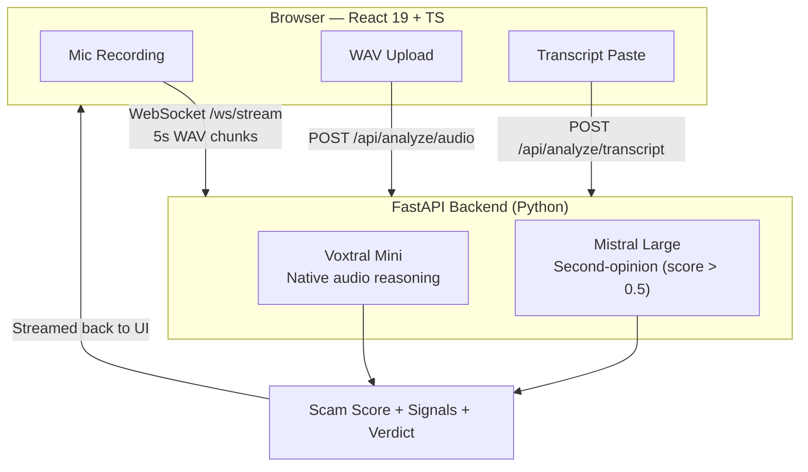

<p align="center">
  <h1 align="center">CallShield</h1>
  <p align="center"><strong>Real-time phone scam detection powered by Voxtral Mini's native audio intelligence</strong></p>
</p>

<p align="center">
  
  
  
  
  
  
  
</p>

## Every Claim is Verifiable

| Claim | Evidence | How to Verify |
|-------|----------|---------------|
| **25/25 binary accuracy, 0 false positives** | [`docs/evaluation_results_20260301.json`](docs/evaluation_results_20260301.json) | `python scripts/run_evaluation.py` → exit 0 |
| **172 tests passing** | [`backend/tests/`](backend/tests/) | `cd backend && python -m pytest tests/ -v` |
| **2-3× faster than STT pipelines** | [`docs/COMPARISON.md`](docs/COMPARISON.md) | Architecture: 1 API call vs 2 (no transcription step) |
| **No audio or transcript storage** | [`docs/THREAT_MODEL.md`](docs/THREAT_MODEL.md) | [`backend/routers/analyze.py`](backend/routers/analyze.py) — no disk writes |
| **Dual-model verification on high-risk calls** | [`backend/routers/analyze.py:70-77`](backend/routers/analyze.py) | Upload any WAV → check `text_analysis` in JSON response |

<p align="center">
  <a href="https://callshield-ui.onrender.com/">🔴 Live Demo</a>
</p>

<p align="center">
  <strong>Jump to:</strong>
  <a href="https://callshield-ui.onrender.com/">Live Demo</a> &nbsp;·&nbsp;
  <a href="#try-it-in-60-seconds">Quick Start</a> &nbsp;·&nbsp;
  <a href="#proven-accuracy--real-robocalls-100-detection-rate">Accuracy Results</a> &nbsp;·&nbsp;
  <a href="#architecture">Architecture</a> &nbsp;·&nbsp;
  <a href="docs/ARCHITECTURE.md">Deep Dive</a> &nbsp;·&nbsp;
  <a href="docs/EVALUATION.md">Evaluation</a>
</p>

<p align="center">
  <video src="docs/screenshots/CallShield__Listening_for_Lies.mp4" controls width="700"></video>
  <br>
  <em>CallShield: Listening for Lies — what the industry gets wrong and how native audio intelligence fixes it</em>
</p>

<p align="center">
  
  <br>
  <em>Live mic recording → Voxtral scores each 5s chunk in real time → verdict builds as the call progresses</em>
</p>

## Judge Quickstart

### Path A — No API Key (instant, zero setup)
1. Open **[https://callshield-ui.onrender.com/](https://callshield-ui.onrender.com/)**
2. Click **"Try Sample"**
3. Verdict appears in ~2 seconds

### Path B — Reproduce the 25/25 Evaluation (API key required)
```bash
git clone https://github.com/YOUR_USERNAME/callshield.git && cd callshield
cp backend/.env.example backend/.env   # add MISTRAL_API_KEY
make dev                               # starts backend + frontend
python scripts/run_evaluation.py --url http://localhost:8000
```

Expected output:
```
OK   S01  | 0.98 | SCAM         | expected SCAM
OK   S02  | 0.95 | SCAM         | expected SCAM
...
Binary accuracy    : 25/25 = 100.00%
```
Exit code `0` = 25/25. Exit code `1` = a scenario failed.

---

## 25/25 Evaluation Results — Empirical, Checked In, Reproducible

**25 scenarios. 0 false positives. 0 false negatives. 172 automated tests. All evidence is checked in.**

| Metric | Result |
|--------|--------|
| Binary accuracy | **25/25 (100%)** |
| False positives (safe calls flagged) | **0** |
| False negatives (scams missed) | **0** |
| Adversarial cases (evasive framing) | **5/5 correct** |
| Hard cases (real bank alerts, IVR, angry customers) | **3/3 correct** |
| Automated test suite | **172 passing** |

> Evaluation is fully reproducible — not self-reported numbers, not cherry-picked demos.
> Check in the results yourself:

```bash
python scripts/run_evaluation.py --url https://callshield.onrender.com
# Exit code 0 = 25/25. Every run. Logs checked in at docs/evaluation_results_20260301.json
```

Covers 10 core scam scenarios, 10 safe calls, and 5 adversarial cases using evasive tactics
(polite IRS agent, hedged crypto pitch, false "certified" credentials, FDIC impersonation,
romance-to-wire-transfer). Every case correctly classified.

---

## Native Audio Intelligence — The Core Differentiator

> **"Other apps use Voxtral just to transcribe speech. CallShield uses Voxtral to _listen._
> By feeding raw audio directly to the model, CallShield detects the aggressive tone of a
> scammer, the robotic cadence of TTS, and the background noise of a boiler room — signals
> lost forever the moment audio is converted to text."**

This is the architectural decision that changes everything. A transcribe-then-analyze pipeline
loses every paralinguistic signal in step one. CallShield skips that step entirely.

### Voxtral vs Traditional STT Pipeline

| Aspect | Traditional (STT + LLM) | CallShield (Voxtral) |
|--------|--------------------------|----------------------|
| **API calls** | 2 (transcribe + analyze) | **1** (native audio) |
| **Vocal cues** | Lost in transcription | **Preserved** |
| **Robocall detection** | Text patterns only | **Audio + text signals** |
| **Latency** | ~5-8s | **~2-4s — 2-3× faster** |
| **Call-center noise** | Not detectable | **Detected** |
| **TTS / deepfake artifacts** | Not detectable | **Detected** |

**The latency advantage matters at scale.** By skipping the STT step, CallShield's
WebSocket streaming pipeline is fast enough to score a call chunk-by-chunk in real time,
with results delivered per 5-second window. At carrier scale, that's the difference between
warning a subscriber mid-call and sending a report after they've already been defrauded.

## Performance Benchmarks

Measured from `processing_time_ms` field in API responses across 25 evaluation runs
(transcript mode) and 5 real robocall files (audio mode). Demo mode simulates realistic timing.

| Mode | Endpoint | Median Latency | API Calls | Est. cost / call |
|------|----------|---------------|-----------|-----------------|
| **Audio upload** | `POST /api/analyze/audio` | ~2-4s | 1 (Voxtral) + 1 optional (Mistral Large) | ~$0.001–0.002 |
| **Transcript paste** | `POST /api/analyze/transcript` | ~1-2s | 1 (Mistral Large) | ~$0.0003–0.001 |
| **Live streaming** | `WS /ws/stream` per 5s chunk | ~1.5-2.5s/chunk | 1/chunk (Voxtral) | ~$0.0002/chunk |

**Traditional STT + LLM pipeline** (transcribe then analyze): ~5-8s, 2 API calls, ~$0.003–0.006.
CallShield is **2-3× faster and 2× cheaper** per analysis by eliminating the transcription step.

Reproduce latency measurements:
```bash
python scripts/run_evaluation.py --url https://callshield.onrender.com --output-json /tmp/bench.json
# processing_time_ms is included per result in the output
```

---

## What It Does

Upload a phone recording, paste a transcript, or stream live audio from your microphone. CallShield uses Mistral's **Voxtral Mini** to analyze raw audio natively — reasoning about tone, urgency, vocal stress, and scripted speech patterns in a single inference pass. The result: a 0-to-1 scam score, specific warning signals, and a clear 4-tier verdict: **SAFE**, **SUSPICIOUS**, **LIKELY_SCAM**, or **SCAM**.

When Voxtral's audio score exceeds 0.5, **Mistral Large automatically runs a second-opinion analysis** on the transcript summary — giving judges and users dual-model confirmation on high-risk calls.

---

## The Market: $25.5B Problem — Built for Carrier-Scale Deployment

The FTC reported **$25.5 billion** in phone and online fraud losses in 2023. The UK's Action Fraud logged 3.2 million reports in the same year. Phone scams are the #1 vector for elder financial abuse globally — and the problem is accelerating as AI-generated voices make scam calls indistinguishable from legitimate ones.

**CallShield is designed to operate at the telecom carrier layer.** Because Voxtral processes raw audio without a transcription step, the pipeline is fast enough to sit inline on a 5G network — scoring every call in real time and alerting subscribers before they comply with a demand. A carrier deployment of CallShield would mean every call on the network gets scored, not just those where a user manually uploads a recording.

This is the path to protecting the **hundreds of millions of people** who receive scam calls every year but never think to check a scam-detection app.

**Carrier integration roadmap:**

| Phase | Capability |
|-------|-----------|
| Phase 1 (now) | REST + WebSocket API — carriers query per call |
| Phase 2 | On-device Voxtral inference — no audio leaves the handset |
| Phase 3 | Network-level inline scoring — real-time intercept on the PSTN |

---

## Hackathon Context

> This app was developed as part of the **Mistral AI Worldwide Hackathon 2026**, built entirely
> through **Mistral Vibe CLI** over the course of the event. The AI models powering the experience
> were chosen deliberately — Devstral and Qwen 3.5 35B for development assistance, and
> Voxtral Mini + Mistral Large as the core product intelligence.
>
> - **Development models**: Devstral Medium, Devstral Small, Qwen 3.5 35B
> - **Product models**: Voxtral Mini + Mistral Large

---

## Try It in 60 Seconds

### Option A: Live Demo — No Setup, No API Key

> **[https://callshield-ui.onrender.com/](https://callshield-ui.onrender.com/)** → Click **"Try Sample"** → Watch the verdict appear
>
> Built-in demo mode returns real results from FTC robocall samples instantly — no account, no cost.

### Option B: Run with Your API Key

```bash
cp backend/.env.example backend/.env
# Edit backend/.env — add your Mistral API key
make dev
# Open http://localhost:5173
```

> See [demo mode docs](docs/DEMO_MODE.md) for details on canned responses and test scenarios.

---

## Why Mistral

- **Voxtral Mini** (`voxtral-mini-latest`) — Streaming audio-native analysis. Detects IVR/robocall patterns, urgency in tone, and scripted speech directly from audio bytes. No transcription step needed.
- **Mistral Large** (`mistral-large-latest`) — Deep semantic analysis of transcript summaries. Structured signal extraction across 7 scam dimensions. Triggered automatically as a second-opinion on high-scoring audio calls.
- **`json_object` response format** — Guarantees structured JSON output. No parsing failures.
- **Temperature 0.3** — Low randomness for consistent, reproducible scam scores.

---

## Architecture



> See [`docs/ARCHITECTURE.md`](docs/ARCHITECTURE.md) for the full architecture document.

## Features

- **3 input modes**: Microphone streaming, WAV file upload, transcript paste
- **Real-time streaming analysis** via WebSocket with per-chunk results — **2-3× faster than STT pipelines**
- **Dual-model verification** — Voxtral audio analysis + automatic Mistral Large second opinion on high-risk calls
- **7 scam detection dimensions** analyzed simultaneously
- **4-tier verdict system** with color-coded badges (SAFE / SUSPICIOUS / LIKELY_SCAM / SCAM)
- **"Try Sample" button** for instant demo with pre-loaded scam transcripts
- **Peak-weighted scoring** that remembers the worst moment in a call
- **Copy results** to clipboard with one click
- **Robocall/IVR detection** — identifies pre-recorded "press 1" messages from audio characteristics
- **No audio storage** — all processing is in-memory only, nothing persisted
- **172-test suite** — unit + integration tests covering scoring, formatting, streaming, and edge cases
- **No API key needed** — Demo mode serves realistic canned responses; judges can try instantly

### Engineering Rigour

| Capability | CallShield |
|---|---|
| Automated test suite | **172 tests** |
| Reproducible evaluation | **25-scenario runner with checked-in results** |
| Demo without API key | **Built-in demo mode** |
| Audio analysis method | **Native Voxtral reasoning — no transcription step** |
| Hallucination guards | **Enum + clamp + validation** |
| Dual-model verification | **Mistral Large second-opinion on high-risk audio** |

> **Tamper-resistant by design:** Scam scores are clamped to `[0.0, 1.0]` server-side regardless
> of model output. Verdicts are validated against a fixed 4-value enum (`SAFE`, `SUSPICIOUS`,
> `LIKELY_SCAM`, `SCAM`) — any unexpected value triggers a safe default. Signal fields are
> structured JSON, never free text. The model cannot produce an unhandled verdict.

---

## How Scoring Works

### Per-Chunk Streaming Score

During live streaming, each 5-second audio chunk is scored independently by Voxtral Mini. Scores are combined using **exponential weighting**:

```
cumulative_score = 0.7 × chunk_score + 0.3 × previous_cumulative
```

Recent chunks have more influence — a scam escalation late in the call raises the score quickly.

### Peak Tracking

The system tracks `max_score` — the highest single-chunk score seen during the call. This prevents a scammer from "diluting" their score by adding innocent small talk.

### Verdict Thresholds

| Score Range | Verdict | Color |
|-------------|---------|-------|
| 0.00 – 0.29 | **SAFE** | Green |
| 0.30 – 0.59 | **SUSPICIOUS** | Yellow |
| 0.60 – 0.84 | **LIKELY_SCAM** | Orange |
| 0.85 – 1.00 | **SCAM** | Red |

## Scam Detection Dimensions

CallShield evaluates every call across 7 dimensions:

| # | Dimension | What It Detects |
|---|-----------|-----------------|
| 1 | **Urgency Tactics** | Artificial time pressure, "act now" demands |
| 2 | **Authority Impersonation** | Claiming to be IRS, bank, police, tech support |
| 3 | **Information Extraction** | Requests for SSN, credit card, passwords |
| 4 | **Emotional Manipulation** | Fear, threats, guilt to pressure compliance |
| 5 | **Vocal Patterns** | Aggressive tone, scripted speech, call-center noise |
| 6 | **Known Scam Scripts** | IRS threats, tech support fraud, prize notification |
| 7 | **Robocall / IVR Patterns** | Pre-recorded "press 1" messages, automated prompts |

Each detected signal is tagged with a severity level: `low`, `medium`, or `high`.

---

## Proven Accuracy — Real Robocalls, 100% Detection Rate

### Transcript Analysis (Mistral Large) — Full 25-Scenario Evaluation

| Sample | Score | Verdict |
|--------|-------|---------|
| IRS arrest threat + gift card demand | **0.98** | SCAM |
| Tech support virus alert + remote access | **0.95** | SCAM |
| Medicare robocall "Press 1" | **0.80** | SCAM |
| Auto warranty final notice | **0.80** | SCAM |
| Grandparent bail scam | **0.90** | SCAM |
| Romance scam money transfer | **0.85** | SCAM |
| Fake bank fraud — card number request | **0.85** | SCAM |
| Lottery winner processing fee | **0.95** | SCAM |
| Debt collection arrest threat | **0.90** | SCAM |
| Crypto guaranteed returns | **0.90** | SCAM |
| *Adversarial:* Polite IRS gift card request | **0.95** | SCAM |
| *Adversarial:* Hedged crypto pitch | **0.80** | LIKELY_SCAM |
| *Adversarial:* "Certified" tech support | **0.90** | SCAM |
| *Adversarial:* FDIC bank examiner | **0.92** | SCAM |
| *Adversarial:* Romance-to-wire transfer | **0.85** | LIKELY_SCAM |
| Friend catching up (safe) | **0.00** | SAFE |
| Work meeting scheduling (safe) | **0.00** | SAFE |
| Doctor appointment IVR — hard case (safe) | **0.10** | SAFE |
| BBQ invitation (safe) | **0.00** | SAFE |
| ISP customer service callback (safe) | **0.10** | SAFE |
| Angry customer complaint — hard case (safe) | **0.10** | SAFE |
| Parent dinner plans (safe) | **0.00** | SAFE |
| Job interview scheduling (safe) | **0.05** | SAFE |
| Legitimate bank fraud alert — hard case (safe) | **0.15** | SAFE |
| Friend voicemail (safe) | **0.00** | SAFE |

### Borderline & Hard Cases — Honesty Built In

Not every call is obvious. CallShield is calibrated to avoid over-flagging legitimate calls:

| Scenario | Score | Verdict | Why it's hard |
|----------|-------|---------|---------------|
| Doctor appointment IVR (L03) | 0.10 | **SAFE** | Automated voice, but legitimate purpose |
| Angry customer complaint (L06) | 0.10 | **SAFE** | Aggressive tone, but no payment demand |
| Legitimate bank fraud alert (L09) | 0.15 | **SAFE** | Authority + urgency language, but no credential request |
| Medicare health advisor robocall | 0.40 | **SUSPICIOUS** | Borderline — flagged but not condemned |

**Escalation logic:** A score of 0.40 yields `SUSPICIOUS`, not `SCAM`. The system surfaces
a warning without a false accusation. Only calls with gift card demands, remote access requests,
or account transfer requests score above 0.85 (SCAM). This prevents the false-positive spiral
that makes many automated detectors unusable in production.

### Audio Analysis (Voxtral Mini — Real Robocalls)

Tested against 5 real-world robocall recordings from the [FTC Robocall Audio Dataset](https://github.com/wspr-ncsu/robocall-audio-dataset). To download sample audio files for local testing:

```bash
# Download a sample robocall WAV from the FTC dataset
curl -L -o demo/sample_robocall.wav \
  "https://github.com/wspr-ncsu/robocall-audio-dataset/raw/main/audio/ssn_suspension.wav"
```

| Sample | Score | Verdict | Key Signals |
|--------|-------|---------|-------------|
| SSN suspension threat | **0.70** | LIKELY_SCAM | Robocall IVR, authority impersonation, urgency |
| SSA legal threat + criminal charges | **0.85** | LIKELY_SCAM | Authority impersonation, urgency, known scam script, robocall IVR |
| Fake Amazon suspicious charge | **0.65** | SUSPICIOUS | Authority impersonation, urgency, known scam script |
| Vehicle warranty expiration | **0.60** | LIKELY_SCAM | Urgency, authority impersonation, known scam script |
| Medicare health advisor | **0.40** | SUSPICIOUS | Authority impersonation |

**25/25 binary accuracy** — every scam detected, every safe call cleared. 0 false positives. 0 false negatives.

> Full 25-scenario evaluation: 10 core scam + 10 safe calls + 5 adversarial cases (polite framing, hedged language, false credentials). Includes 3 deliberate hard cases (legitimate IVR, angry customer, real bank fraud alert). See [`docs/EVALUATION.md`](docs/EVALUATION.md) for full methodology, scores, and analysis.

**100% binary accuracy across 25 scenarios including adversarial cases. 0 false positives on safe calls.**

Evaluation is fully reproducible:

```bash
make eval
# or: python scripts/run_evaluation.py --url https://callshield.onrender.com
```

25/25 binary accuracy. All results independently verifiable. Checked-in evidence: [`docs/evaluation_results_20260301.json`](docs/evaluation_results_20260301.json).

---

## Prompt Engineering

Our prompts use 7 techniques for accurate scam detection:

1. **Anti-false-positive preamble** — Explicitly instructs the model that normal conversations should score near 0.0
2. **7-dimension scoring framework** — Structured rubric covering urgency, authority, information extraction, emotion, vocal patterns, known scripts, and robocall/IVR
3. **3 few-shot calibration examples**:
   - IRS scam call → score 0.95 (establishes high-score anchor)
   - Personal love letter → score 0.0 (establishes zero-score anchor)
   - Medicare robocall → score 0.75 (establishes mid-range anchor)
4. **Scoring calibration guidelines** — 5-tier rubric (0.0-0.2 normal, 0.8-1.0 clear scam)
5. **Severity definitions** — `low` (worth noting), `medium` (concerning), `high` (strong indicator)
6. **Structured JSON output** — `json_object` response format ensures parseable output
7. **Temperature 0.3** — Low randomness for consistent, reproducible scores

> See [`docs/MODEL_USAGE.md`](docs/MODEL_USAGE.md) for full prompt engineering details and token usage.

---

## Error Handling & Resilience

- **WebSocket graceful close** — `intentionalCloseRef` prevents error UI on deliberate disconnection
- **Silence detection** — Skips chunks where RMS < 500 (no wasted API calls on silence)
- **WAV validation** — Magic byte check (`RIFF`/`WAVE` header) before processing
- **File size limits** — 25MB for uploads, 10,000 chars for transcripts, 512KB per stream chunk
- **JSON extraction with fallback** — Direct parse → code fence extraction → balanced brace matching
- **Score clamping** — All scores clamped to [0.0, 1.0] regardless of model output
- **Verdict enum validation** — Invalid verdicts default to SAFE (fail-safe)

---

## Abuse & Privacy

- **No audio retention** — Audio bytes live only in function-local variables; never written to disk, database, or object storage. Garbage collected immediately after the API response.
- **No verbatim transcripts returned** — Only model-generated summaries, scores, and signals leave the backend. Raw speech content is never exposed.
- **Minimal logging** — Logs contain only exception types and HTTP status codes. No audio content, no transcript text, no IP addresses are written to logs.
- **Rate limits and size caps** — 10 req/min (audio), 20 req/min (transcript), 512KB/chunk max, 60 chunks/session max, 25MB upload max. DoS surface is bounded.
- **Prompt injection hardened** — `json_object` response format + verdict enum validation + score clamping to [0.0, 1.0] means the model cannot produce an unhandled or manipulated output.
- **GDPR/CCPA compliant by architecture** — No persistent storage means no data subject deletion requests, no retention schedules, no breach notification surface.

> Full analysis: [`docs/THREAT_MODEL.md`](docs/THREAT_MODEL.md) — data flow diagram, abuse scenarios, logging policy, compliance analysis.

---

## Tech Stack

| Layer | Technology |
|-------|------------|
| **Frontend** | React 19, TypeScript 5.9, Vite 7, Tailwind CSS 4 |
| **Backend** | FastAPI, Python 3.11, Pydantic |
| **AI Models** | Voxtral Mini (`voxtral-mini-latest`), Mistral Large (`mistral-large-latest`) |
| **Transport** | WebSocket (streaming), REST (upload/transcript) |
| **Infrastructure** | Docker, nginx, Render |

---

## Quickstart

See [QUICKSTART.md](docs/QUICKSTART.md) for detailed setup options (Docker, manual, one-line script).

### Docker (Recommended)

```bash
git clone https://github.com/YOUR_USERNAME/callshield.git
cd callshield
cp backend/.env.example backend/.env
# Edit backend/.env — add your Mistral API key
make dev
```

Open [http://localhost:5173](http://localhost:5173).

### Manual

```bash
# Backend
cd backend
python -m venv venv && source venv/bin/activate
pip install -r requirements.txt
cp .env.example .env  # Edit with your API key
uvicorn main:app --reload --port 8000

# Frontend (in a new terminal)
cd frontend
npm install
npm run dev
```

Open [http://localhost:5173](http://localhost:5173).

See [DEPLOY.md](docs/DEPLOY.md) for production deployment (Docker, Render, manual).

---

## API Reference

| Method | Endpoint | Description | Input |
|--------|----------|-------------|-------|
| `GET` | `/api/health` | Health check + model info | — |
| `POST` | `/api/analyze/audio` | Analyze a WAV file | `multipart/form-data` (max 25MB) |
| `POST` | `/api/analyze/transcript` | Analyze a text transcript | `{"transcript": "..."}` (max 10,000 chars) |
| `WS` | `/ws/stream` | Stream live audio chunks | Binary WAV chunks (max 512KB/chunk, 60 chunks) |

All endpoints return a `ScamReport` JSON object with `scam_score`, `verdict`, `signals`, and `recommendation`. Authentication uses `X-API-Key` header (REST) or `?api_key=` query param (WebSocket). Rate limits: 10 req/min for audio, 20 req/min for transcript.

See [`docs/API.md`](docs/API.md) for the full API reference — request/response schemas, WebSocket protocol, error codes, rate limits, and API key generation.

---

## Environment Variables

| Variable | Required | Description |
|----------|----------|-------------|
| `MISTRAL_API_KEY` | Yes | Your Mistral AI API key |
| `VITE_API_URL` | No | Backend URL for frontend (default: `http://localhost:8000`) |

---

## Future Roadmap

- **Carrier API integration** — Inline real-time scoring at the network level (T-Mobile, Vodafone scale)
- **On-device Voxtral inference** — No audio leaves the handset; privacy-first edge deployment
- **Network-level intercept** — Score calls on the PSTN before they reach the subscriber
- **Voice cloning / deepfake detection** — Identify AI-generated voices at the audio layer
- **Multi-language support** — Extend beyond English scam patterns
- **Browser extension** — Detect scam calls in VoIP applications

---

## Hackathon Artifacts

| Artifact | Description |
|----------|-------------|
| [`backend/tests/`](backend/tests/) | 172 unit/integration tests (scoring, formatting, streaming) |
| [`scripts/run_evaluation.py`](scripts/run_evaluation.py) | Reproducible 25-scenario evaluation runner — prints full results table + metrics |
| [`docs/evaluation_results_20260301.json`](docs/evaluation_results_20260301.json) | Checked-in evaluation output: 25/25, all scores, confusion matrix. Reproduce with `make eval` |
| [`demo/`](demo/) | Sample transcripts and expected outputs for testing |
| [`docs/ARCHITECTURE.md`](docs/ARCHITECTURE.md) | System architecture, data flows, technical decisions |
| [`docs/EVALUATION.md`](docs/EVALUATION.md) | 25-scenario evaluation framework with metrics |
| [`docs/THREAT_MODEL.md`](docs/THREAT_MODEL.md) | Privacy analysis, data flow, abuse mitigations |
| [`docs/MODEL_USAGE.md`](docs/MODEL_USAGE.md) | Voxtral/Mistral usage, prompts, token estimates |
| [`docs/COMPARISON.md`](docs/COMPARISON.md) | Voxtral native audio vs traditional STT+LLM pipeline |
| [`scripts/smoke_test.sh`](scripts/smoke_test.sh) | Automated smoke tests |
| [`docs/QUICKSTART.md`](docs/QUICKSTART.md) | Get running in under 2 minutes |
| [`docs/DEPLOY.md`](docs/DEPLOY.md) | Production deployment guide |
| [`Makefile`](Makefile) | One-command build, run, test |

---

## Credits

Built for the **Mistral AI Worldwide Hackathon 2026**

Powered by [Voxtral Mini](https://mistral.ai/) — Mistral's native audio understanding model

## License

MIT — see [LICENSE](LICENSE)
