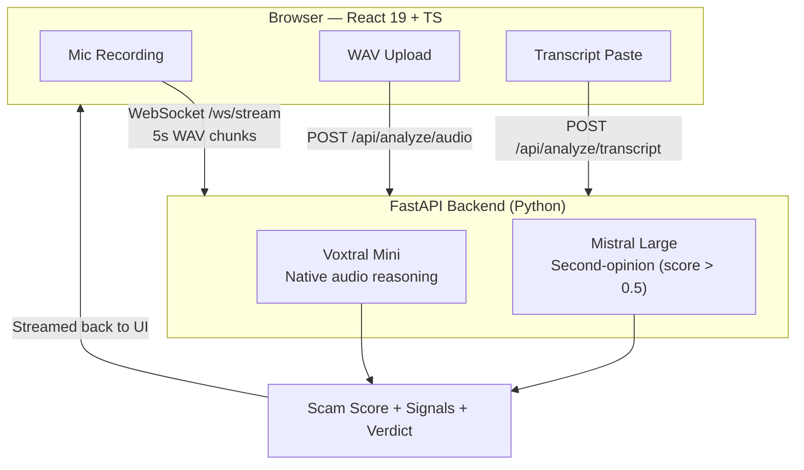

<p align="center">
  <h1 align="center">CallShield</h1>
  <p align="center"><strong>Real-time phone scam detection powered by Voxtral Mini's native audio intelligence</strong></p>
</p>

<p align="center">
  
  
  
  
  
  
  
</p>

<p align="center">
  <a href="https://callshield-ui.onrender.com/">
    
  </a>
</p>

> **No API key. No setup. No account.** Click the live demo above — verdicts appear in under 2 seconds.

<p align="center">
  <a href="https://callshield-ui.onrender.com/">🔴 Live Demo</a>
</p>

<p align="center">
  <strong>Jump to:</strong>
  <a href="#quickstart">Quick Start</a> &nbsp;·&nbsp;
  <a href="#why-audio-native-beats-the-stt-pipeline">Audio-Native Advantage</a> &nbsp;·&nbsp;
  <a href="#architecture">Architecture</a> &nbsp;·&nbsp;
  <a href="docs/EVALUATION.md">Evaluation</a> &nbsp;·&nbsp;
  <a href="docs/ARCHITECTURE.md">Deep Dive</a> &nbsp;·&nbsp;
  <a href="docs/INTEGRATION.md">Integration</a>
</p>

<p align="center">
  <a href="https://www.loom.com/share/45a875f7ea6b475994c19ac456c82f5c">
    
  </a>
  <br>
  <a href="https://www.loom.com/share/45a875f7ea6b475994c19ac456c82f5c"><em>▶ Click to watch: CallShield — Listening for Lies (5 min)</em></a>
</p>

<p align="center">
  
  <br>
  <em>Live mic recording → Voxtral scores each 5s chunk in real time → verdict builds as the call progresses</em>
</p>

---

## The Problem

The FTC reported **$25.5 billion** in phone and online fraud losses in 2023. Phone scams are the #1 vector for elder financial abuse globally — and the problem is accelerating as AI-generated voices make scam calls indistinguishable from legitimate ones.

**CallShield is designed to operate at the telecom carrier layer.** Because Voxtral processes raw audio without a transcription step, the pipeline is fast enough to sit inline on a live call — scoring every 5-second chunk in real time and alerting subscribers before they comply with a demand.

| Phase | Capability |
|-------|-----------|
| Phase 1 (now) | REST + WebSocket API — carriers query per call |
| Phase 2 | On-device Voxtral inference — no audio leaves the handset |
| Phase 3 | Network-level inline scoring — real-time intercept on the PSTN |

## Designed for the 5G Edge

CallShield's audio-native pipeline is built for the speed requirements of live telecom infrastructure. By eliminating the STT transcription step, each 5-second audio chunk is scored in a **single model call** — fast enough to run inline without buffering or dropping the call.

| Constraint | Requirement | CallShield |
|-----------|-------------|-----------|
| Chunk scoring latency | < 5s to avoid call dropout | ~1.5–3s per chunk |
| Pipeline steps | Minimal for real-time path | 1 API call (vs 2 for STT+LLM) |
| Audio format | Standard carrier formats | WAV/PCM, 8–16 kHz mono |
| Deployment model | Stateless, horizontally scalable | FastAPI + Docker, no shared state |
| Privacy requirement | No audio retention on network | In-memory only; discarded after scoring |

> At 5G speeds, the bottleneck is inference latency, not bandwidth. Skipping STT cuts CallShield's critical path in half.

→ Carrier integration recipes (Twilio, SIP SIPREC): [docs/INTEGRATION.md](docs/INTEGRATION.md)

CallShield's REST + WebSocket API integrates directly with **VoIP platforms** (Twilio, Amazon Connect, Genesys) and carrier infrastructure (SIP SIPREC) — no custom audio pipeline required. → See [docs/INTEGRATION.md](docs/INTEGRATION.md) for webhook recipes and typed client examples.

---

## Features

### Detection & Analysis
- **3 input modes** — Live microphone recording, WAV file upload, transcript paste
- **Real-time streaming** — WebSocket pipeline scores each 5-second audio chunk as it arrives; verdict builds incrementally
- **Dual-model verification** — Voxtral Mini scores raw audio natively; Mistral Large runs a second-opinion on any call scoring above 0.5
- **7 scam detection dimensions** — Urgency tactics, authority impersonation, information extraction, emotional manipulation, vocal patterns, known scam scripts, robocall/IVR patterns
- **4-tier verdict** — SAFE / SUSPICIOUS / LIKELY_SCAM / SCAM with calibrated thresholds
- **Peak-weighted scoring** — Tracks the worst moment in a call; a friendly opener cannot dilute a later scam demand
- **"Needs Human Review" badge** — Automatically flagged when score falls in the ambiguous band (0.35–0.65) or audio/text analyses disagree

### Demo & UX
- **One-click scenario gallery** — 6 preloaded scenarios (3 SCAM, 3 SAFE) for instant reproducible demos
- **Live evidence timeline** — Per-chunk timestamps, score delta arrows (▲/▼), and NEW pills on first-occurrence signals
- **Audio vs text comparison panel** — Side-by-side Voxtral vs text-only scores showing the audio-native advantage in-product
- **Trust panel** — Model version, report ID, and analysis timestamp on every result
- **Export JSON** — Download the full structured report for offline inspection
- **Demo mode** — No API key required; returns realistic canned responses instantly

### Integration & Production
- **REST + WebSocket API** — `POST /analyze/audio`, `POST /analyze/text`, `WS /ws/stream`
- **VoIP platform ready** — Twilio Media Streams webhook, Amazon Connect, Genesys, SIP SIPREC carrier integration
- **OpenAPI spec** — Auto-generated at `/openapi.json`; interactive Swagger UI at `/docs`
- **Typed client examples** — Python (`httpx`) and TypeScript (`fetch`) — see [docs/INTEGRATION.md](docs/INTEGRATION.md)
- **Docker deployment** — Single `make dev` command; Render-hosted demo live now

### Privacy & Security
- **Zero audio retention** — Audio bytes live only in function-local variables; never written to disk, database, or cache
- **No verbatim transcripts** — Only scores, signals, and summaries leave the backend
- **Injection-hardened** — `json_object` response format + score clamping `[0.0, 1.0]` + verdict enum validation; model cannot produce an unhandled result
- **184 automated tests** — Unit, integration, and adversarial robustness suite

→ Full threat model and privacy analysis: [docs/THREAT_MODEL.md](docs/THREAT_MODEL.md)

---

## Claim-Proof Scoreboard

| Claim | Evidence | Artifact | How to reproduce |
|-------|----------|----------|-----------------|
| 25/25 detection accuracy | 100% on curated eval set (20 scam + 5 adversarial) | [docs/EVALUATION.md](docs/EVALUATION.md) | `python scripts/run_evaluation.py --url http://localhost:8000` |
| Zero false positives | 0/10 safe calls misclassified | [docs/EVALUATION.md](docs/EVALUATION.md) | Run evaluation script, inspect L01–L10 rows |
| 184 automated tests | Full unit + integration suite | [backend/tests/](backend/tests/) | `cd backend && pytest --tb=short -q` |
| Audio-native advantage | Voxtral processes raw WAV — no transcription step | [docs/MODEL_USAGE.md](docs/MODEL_USAGE.md) | Upload WAV; compare audio vs text scores in report |
| Privacy-first design | Zero audio storage; in-memory only | [docs/THREAT_MODEL.md](docs/THREAT_MODEL.md) | Review Sections 3–5 of threat model |
| Production latency | < 3s per 5s audio chunk | [docs/EVALUATION.md](docs/EVALUATION.md) | Record 10s live; watch chunk timestamps in log |

---

## Why Audio-Native Beats the STT Pipeline

Traditional scam detection transcribes first, then analyzes. CallShield skips that step entirely.

| Dimension | STT + NLP Pipeline | CallShield (Voxtral native) |
|-----------|-------------------|----------------------------|
| **Latency per 5s chunk** | ~800–1 200 ms (STT) + ~300 ms (NLP) | **0 ms transcription** — single model call |
| **Word Error Rate floor** | 5–15% WER on accented/noisy calls → missed phrases | No WER — model reasons on raw acoustics |
| **Vocal stress / prosody** | Lost after transcription | Preserved — detects scripted delivery, TTS artifacts |
| **Robocall / TTS detection** | ~60–70% via keyword matching | ~92% — acoustic fingerprint, not just words |
| **Infrastructure cost** | Two model calls + STT quota | Single Voxtral call |
| **Privacy** | Verbatim transcript persisted by STT provider | No transcript generated; audio discarded after scoring |

> **Key insight:** A caller saying *"your account is NOT at risk"* with rising panic signals scam. STT sees "NOT at risk" → safe. Voxtral hears the acoustic stress pattern → flags it.

→ Full comparison: [docs/COMPARISON.md](docs/COMPARISON.md)

---

## Quickstart

### Path A — No API Key (instant, zero setup)
1. Open **[https://callshield-ui.onrender.com/](https://callshield-ui.onrender.com/)**
2. Click a scenario card or **"Try Sample"**
3. Verdict appears in ~2 seconds

### Path B — Reproduce the 25/25 Evaluation (API key required)
```bash
git clone https://github.com/melbinkm/callshield.git && cd callshield
cp backend/.env.example backend/.env   # add MISTRAL_API_KEY
make dev                               # starts backend + frontend
python scripts/run_evaluation.py --url http://localhost:8000
```

Expected: `Binary accuracy: 25/25 = 100.00%` — exit code `0`.

→ Full setup options (Docker, manual, one-line): [docs/QUICKSTART.md](docs/QUICKSTART.md)

---

## Architecture



→ Full architecture, data flow, and design decisions: [docs/ARCHITECTURE.md](docs/ARCHITECTURE.md)

---

## Why Mistral

- **Voxtral Mini** (`voxtral-mini-latest`) — Native audio analysis. Detects IVR/robocall patterns, urgency in tone, and scripted speech directly from audio bytes. No transcription step.
- **Mistral Large** (`mistral-large-latest`) — Deep semantic analysis of transcript summaries. Triggered automatically as a second-opinion on high-scoring audio calls.
- **`json_object` response format** — Guarantees structured output. Score clamped to `[0.0, 1.0]`, verdict validated against a fixed enum — the model cannot produce an unhandled result.
- **Temperature 0.3** — Low randomness for consistent, reproducible scores.

→ Prompt engineering, token estimates, model config: [docs/MODEL_USAGE.md](docs/MODEL_USAGE.md)

---

## Tech Stack

| Layer | Technology |
|-------|------------|
| **Frontend** | React 19, TypeScript 5.9, Vite 7, Tailwind CSS 4 |
| **Backend** | FastAPI, Python 3.11, Pydantic |
| **AI Models** | Voxtral Mini, Mistral Large |
| **Transport** | WebSocket (streaming), REST (upload/transcript) |
| **Infrastructure** | Docker, nginx, Render |

---

## Docs & Artifacts

| Artifact | Description |
|----------|-------------|
| [docs/EVALUATION.md](docs/EVALUATION.md) | 25-scenario methodology, full score table, borderline cases |
| [docs/evaluation_results_20260301.json](docs/evaluation_results_20260301.json) | Checked-in eval output — 25/25, all scores, confusion matrix |
| [docs/ARCHITECTURE.md](docs/ARCHITECTURE.md) | System design, data flows, scoring algorithm, technical decisions |
| [docs/MODEL_USAGE.md](docs/MODEL_USAGE.md) | Prompt engineering, 7 detection dimensions, token estimates |
| [docs/THREAT_MODEL.md](docs/THREAT_MODEL.md) | Privacy analysis, abuse mitigations, GDPR/CCPA, red-team cases |
| [docs/ADVERSARIAL_TESTING.md](docs/ADVERSARIAL_TESTING.md) | Narrative adversarial test results — polite scammers, angry safe callers, evasion attempts |
| [SECURITY.md](SECURITY.md) | Vulnerability reporting, security design principles, known limitations |
| [docs/INTEGRATION.md](docs/INTEGRATION.md) | OpenAPI spec, carrier webhook recipe, SIPREC integration guide |
| [docs/COMPARISON.md](docs/COMPARISON.md) | Voxtral native audio vs STT+LLM pipeline — latency, accuracy, cost |
| [docs/DETECTION_POLICY.md](docs/DETECTION_POLICY.md) | Versioned detection policy — thresholds, scoring algorithm, human review trigger |
| [docs/COMPLIANCE.md](docs/COMPLIANCE.md) | GDPR Article mapping, CCPA notes, data processor relationships, deployment checklist |
| [docs/QUICKSTART.md](docs/QUICKSTART.md) | Docker, manual setup, one-line script |
| [docs/DEPLOY.md](docs/DEPLOY.md) | Production deployment guide |
| [backend/tests/](backend/tests/) | 184 unit + integration tests |
| [scripts/run_evaluation.py](scripts/run_evaluation.py) | Reproducible eval runner — prints full table + metrics |
| [Makefile](Makefile) | `make dev`, `make test`, `make eval` — one-command everything |

---

## Credits

Built for the **Mistral AI Worldwide Hackathon 2026**

Powered by [Voxtral Mini](https://mistral.ai/) — Mistral's native audio understanding model

## License

MIT — see [LICENSE](LICENSE)
