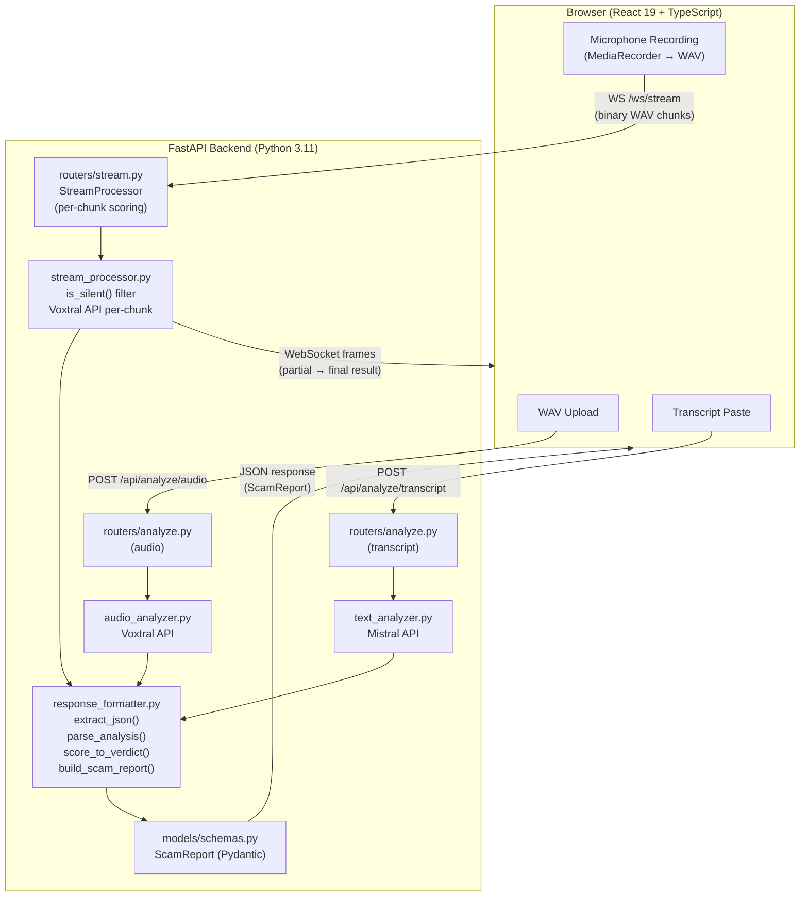

# CallShield Architecture

## System Overview

CallShield is a real-time phone scam detection system that uses Mistral's Voxtral Mini for native audio analysis and Mistral Large for transcript analysis. The system accepts audio files, text transcripts, or live microphone streams, processes them through specialized AI pipelines, and returns structured scam reports with scores, verdicts, and warning signals.

---

## Component Diagram



---

## Data Flows

### Flow 1: Audio Upload

1. User uploads a WAV file via the UI
2. `POST /api/analyze/audio` receives the multipart upload (`routers/analyze.py`)
3. WAV header validated (RIFF/WAVE magic bytes), size checked (≤25 MB)
4. `audio_analyzer.py` base64-encodes the audio, sends to **Voxtral Mini** with scam detection prompt
5. `response_formatter.extract_json()` parses the structured JSON response
6. `response_formatter.parse_analysis_result()` validates and clamps scores
7. `response_formatter.build_scam_report()` wraps into a `ScamReport`
8. JSON response returned to browser

### Flow 2: Transcript Analysis

1. User pastes transcript text (≤10,000 chars)
2. `POST /api/analyze/transcript` receives the JSON body (`routers/analyze.py`)
3. `text_analyzer.py` sends transcript to **Mistral Large** with scam detection prompt
4. Same formatting pipeline: `extract_json` → `parse_analysis_result` → `build_scam_report`
5. JSON response returned to browser

### Flow 3: Live Streaming

1. Browser records microphone audio via `MediaRecorder`
2. Audio converted to WAV chunks (~5 seconds each) and sent over `WS /ws/stream`
3. `stream_processor.py` receives each chunk:
   - `is_silent()` filters silent chunks (RMS < 500) — no API call wasted
   - Non-silent chunks sent to **Voxtral Mini** for per-chunk analysis
   - Scores combined via exponential weighting: `cumulative = 0.7 × chunk + 0.3 × prev`
   - Peak score (`max_score`) tracked across all chunks
4. Partial results streamed back to browser after each chunk
5. On disconnect, `get_final_result()` computes final verdict via `score_to_verdict()`

---

## Scoring Pipeline

### Combined Scoring (Audio + Text)

When both audio and text results are available:

```
combined_score = audio_score × 0.6 + text_score × 0.4
```

Audio is weighted higher (60%) because Voxtral captures vocal cues that text analysis misses.

### Exponential Weighting (Streaming)

During live streaming, chunk scores are combined with exponential decay:

```
cumulative_score = 0.7 × chunk_score + 0.3 × previous_cumulative
```

This means recent chunks have more influence — a scam escalation late in the call raises the score quickly, while early innocuous conversation fades.

### Peak Tracking

`max_score` records the highest single-chunk score seen during a call. This prevents score dilution — a scammer can't lower their overall score by adding small talk.

### Verdict Thresholds

| Score Range | Verdict | Defined In |
|-------------|---------|------------|
| 0.00 – 0.29 | SAFE | `config.py` → `THRESHOLD_SAFE = 0.30` |
| 0.30 – 0.59 | SUSPICIOUS | `config.py` → `THRESHOLD_SUSPICIOUS = 0.60` |
| 0.60 – 0.84 | LIKELY_SCAM | `config.py` → `THRESHOLD_LIKELY_SCAM = 0.85` |
| 0.85 – 1.00 | SCAM | Above all thresholds |

---

## Key Technical Decisions

| Decision | Rationale |
|----------|-----------|
| **`urllib.request` instead of Mistral SDK** | The Mistral Python SDK does not support `input_audio` content blocks. We use raw HTTP for the Voxtral audio endpoint. |
| **Exponential weighting (0.7/0.3)** | Balances recency bias with historical context. A single high-scoring chunk raises the score significantly, but doesn't override everything. |
| **`json_object` response format** | Mistral's structured output mode guarantees valid JSON — eliminates parsing failures. |
| **No database** | Privacy-first design. Zero storage means zero data breach risk. All processing is in-memory, garbage collected after each response. |
| **Pydantic schemas** | Type-safe validation of all API inputs and outputs. Score clamping and enum validation happen at the model layer. |
| **44-byte WAV header skip** | Standard WAV headers are 44 bytes. Skipping them in `is_silent()` gives us raw PCM samples for RMS calculation. |

---

## Security

See [`THREAT_MODEL.md`](THREAT_MODEL.md) for the full security analysis, including:
- Data flow diagram with trust boundaries
- Abuse scenarios and mitigations
- GDPR/CCPA compliance analysis
- Why no audio is ever persisted
