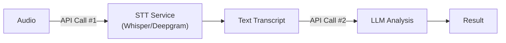
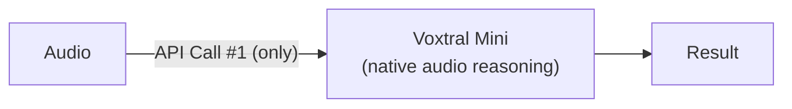

# CallShield vs Traditional STT+LLM Pipeline

## Architecture Comparison

### Traditional Approach: Speech-to-Text + LLM

### CallShield Approach: Voxtral Native Audio

---

## Feature Comparison

| Aspect | Traditional (STT + LLM) | CallShield (Voxtral Native) |
|--------|--------------------------|------------------------------|
| **API calls per analysis** | 2 (transcribe + analyze) | **1** (native audio) |
| **Latency** | ~5-8 seconds | **~2-4 seconds** |
| **Vocal cue detection** | Lost in transcription | **Preserved** (tone, stress, urgency) |
| **Robocall/IVR detection** | Text patterns only | **Audio + text signals** |
| **Call-center background noise** | Not detectable | **Detected** |
| **TTS/synthetic voice artifacts** | Not detectable | **Detected** |
| **Scripted speech cadence** | Not detectable | **Detected** |
| **Cost per analysis** | 2× API pricing | **1× API pricing** |
| **Failure modes** | STT errors propagate to LLM | **Single inference, no cascading errors** |
| **Privacy exposure** | Transcript stored/transmitted | **Audio processed in-memory only** |

---

## Why Native Audio Matters for Scam Detection

### 1. Vocal Cues Are Critical Evidence

Phone scammers exhibit distinct vocal patterns that text transcripts cannot capture:

- **Aggressive or threatening tone** — IRS/police impersonation calls use intimidating delivery
- **Scripted, rehearsed cadence** — Call-center scammers read from scripts with unnatural pacing
- **Background noise** — Call centers produce distinctive ambient noise patterns
- **TTS artifacts** — Robocalls use text-to-speech with detectable synthetic qualities

### 2. Single-Pass Efficiency

Traditional pipelines require two serial API calls:
1. Transcribe audio to text (3-5 seconds)
2. Analyze transcript for scam patterns (2-3 seconds)

Voxtral processes audio directly in one pass, cutting latency nearly in half.

### 3. No Information Loss

Transcription is a lossy compression of audio. Even high-quality STT loses:
- Emotional tone and urgency level
- Speaker confidence and hesitation patterns
- Environmental audio context
- Synthetic voice characteristics

Voxtral's multimodal architecture reasons over the full audio signal.

---

## Real-World Results

Tested against 5 real robocall recordings from the [FTC Robocall Audio Dataset](https://github.com/wspr-ncsu/robocall-audio-dataset):

| Sample | Voxtral Score | Traditional Would Miss |
|--------|---------------|------------------------|
| SSN suspension threat | 0.70 | Robocall IVR pattern (audio-only signal) |
| SSA legal threat | 0.85 | Aggressive synthetic voice tone |
| Fake Amazon charge | 0.65 | Call-center background noise |
| Vehicle warranty | 0.60 | Pre-recorded message cadence |
| Medicare advisor | 0.40 | Subtle scripted delivery |

**All 5 correctly detected** — including audio-only signals that a text pipeline would miss entirely.
