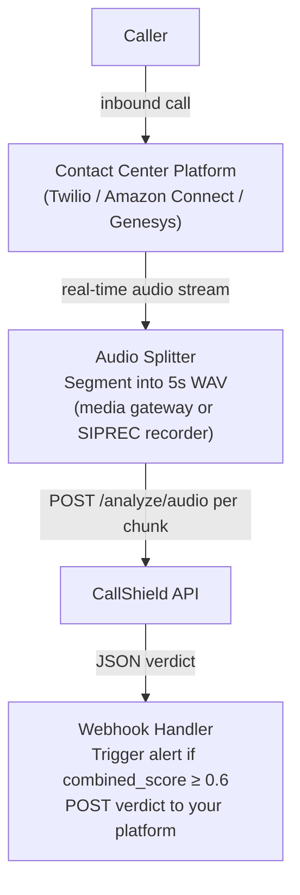
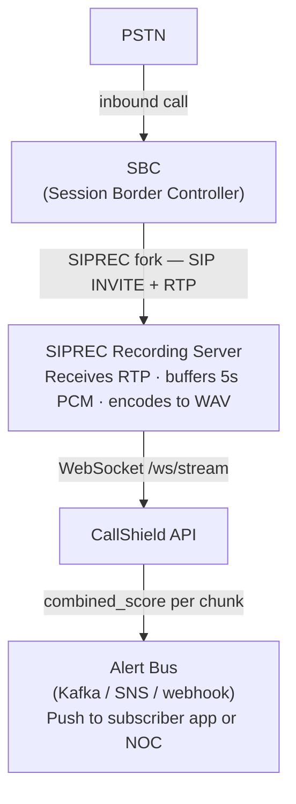

# CallShield Integration Guide

CallShield exposes a REST + WebSocket API for scam detection. This guide covers the OpenAPI spec, authentication, and two integration recipes for common carrier/enterprise environments.

---

## OpenAPI Specification

The live OpenAPI spec is auto-generated by FastAPI and always reflects the current server:

| Endpoint | Description |
|----------|-------------|
| `GET /openapi.json` | Machine-readable OpenAPI 3.1 spec |
| `GET /docs` | Swagger UI (interactive browser-based tester) |
| `GET /redoc` | ReDoc UI (read-only documentation view) |

No authentication is required for the hosted demo. Production deployments should add an `Authorization: Bearer <token>` header at the reverse-proxy layer.

---

## Core Endpoints

### `POST /analyze/text`
Analyze a call transcript.

**Request:**
```json
{
  "transcript": "Hello, this is Agent Thompson from the IRS..."
}
```

**Response:**
```json
{
  "id": "analysis_3f2a...",
  "mode": "text",
  "combined_score": 0.94,
  "audio_analysis": null,
  "text_analysis": {
    "scam_score": 0.94,
    "confidence": 0.91,
    "verdict": "SCAM",
    "signals": [
      { "category": "AUTHORITY_IMPERSONATION", "detail": "Claims to be IRS agent", "severity": "high" },
      { "category": "URGENCY", "detail": "Threatens imminent arrest", "severity": "high" }
    ],
    "recommendation": "Do not comply. Hang up and call the IRS directly at 1-800-829-1040."
  },
  "processing_time_ms": 1240,
  "review_required": false,
  "review_reason": null
}
```

### `POST /analyze/audio`
Analyze a WAV audio file (audio-native Voxtral analysis + text cross-check).

```bash
curl -X POST https://callshield-backend.onrender.com/analyze/audio \
  -F "file=@call_recording.wav"
```

### `WebSocket /ws/stream`
Real-time streaming analysis. Send 5-second WAV chunks; receive partial results after each chunk.

---

## Recipe 1 — Call-Center Webhook Integration

Use this pattern to score every inbound call in a contact center platform (e.g., Twilio, Amazon Connect, Genesys).

### Architecture



### Sample Webhook Handler (Python)

```python
import httpx
import asyncio

CALLSHIELD_URL = "https://callshield-backend.onrender.com"
ALERT_THRESHOLD = 0.6

async def score_chunk(wav_bytes: bytes) -> dict:
    async with httpx.AsyncClient(timeout=30) as client:
        resp = await client.post(
            f"{CALLSHIELD_URL}/analyze/audio",
            files={"file": ("chunk.wav", wav_bytes, "audio/wav")},
        )
        resp.raise_for_status()
        return resp.json()

async def handle_call_chunk(wav_bytes: bytes, call_id: str):
    result = await score_chunk(wav_bytes)
    score = result["combined_score"]
    verdict = (result.get("audio_analysis") or result.get("text_analysis") or {}).get("verdict")

    if score >= ALERT_THRESHOLD:
        await send_alert(call_id, score, verdict, result.get("text_analysis", {}).get("signals", []))

async def send_alert(call_id: str, score: float, verdict: str, signals: list):
    # Replace with your platform's alert API
    print(f"[ALERT] Call {call_id} | Score: {score:.0%} | Verdict: {verdict}")
    for s in signals:
        print(f"  [{s['severity'].upper()}] {s['category']}: {s['detail']}")
```

### Trigger Logic

| `combined_score` | Recommended Action |
|------------------|--------------------|
| < 0.30 | No action |
| 0.30 – 0.59 | Log for review; show soft warning to agent |
| 0.60 – 0.84 | Alert agent; offer to transfer caller to fraud team |
| ≥ 0.85 | Hard alert; optionally play scam warning to caller |

---

## Recipe 2 — Carrier SIP SIPREC Integration

SIPREC (RFC 7245) lets carriers fork a copy of the RTP stream to a recording server. Use this to score calls inline without modifying the call path.

### Architecture



### Key Parameters

| Parameter | Value |
|-----------|-------|
| RTP payload | PCMU (G.711 µ-law) or PCMA (G.711 A-law) |
| Chunk size | 5 seconds of PCM → ~80 KB WAV at 8 kHz mono |
| Encoding before send | Convert to 16 kHz mono WAV (Voxtral optimal sample rate) |
| Max chunk size | 512 KB (server enforced) |
| Max chunks per stream | 60 (= 5 minutes) |
| Latency budget | Allow 3–4 s per chunk for model inference |

### Conversion snippet (ffmpeg)

```bash
# Convert G.711 PCMU RTP payload to 16 kHz mono WAV
ffmpeg -f mulaw -ar 8000 -ac 1 -i chunk.raw \
       -ar 16000 -ac 1 chunk.wav
```

---

## Typed Client Examples

### Python (`httpx`)

```python
import httpx

CALLSHIELD_URL = "https://callshield-backend.onrender.com"

# Analyze a transcript
def analyze_transcript(transcript: str) -> dict:
    with httpx.Client(timeout=30) as client:
        resp = client.post(
            f"{CALLSHIELD_URL}/analyze/text",
            json={"transcript": transcript},
        )
        resp.raise_for_status()
        return resp.json()

# Analyze a WAV file
def analyze_audio(wav_path: str) -> dict:
    with httpx.Client(timeout=60) as client:
        with open(wav_path, "rb") as f:
            resp = client.post(
                f"{CALLSHIELD_URL}/analyze/audio",
                files={"file": ("recording.wav", f, "audio/wav")},
            )
        resp.raise_for_status()
        return resp.json()

# Usage
result = analyze_transcript("Hello, this is Agent Thompson from the IRS...")
print(f"Score: {result['combined_score']:.0%}  Verdict: {result['text_analysis']['verdict']}")
# Score: 94%  Verdict: SCAM
```

### TypeScript (`fetch`)

```typescript
const CALLSHIELD_URL = "https://callshield-backend.onrender.com";

interface Signal {
  category: string;
  detail: string;
  severity: "low" | "medium" | "high";
}

interface AnalysisResult {
  scam_score: number;
  confidence: number;
  verdict: "SAFE" | "SUSPICIOUS" | "LIKELY_SCAM" | "SCAM";
  signals: Signal[];
  recommendation: string;
}

interface ScamReport {
  id: string;
  mode: string;
  combined_score: number;
  audio_analysis: AnalysisResult | null;
  text_analysis: AnalysisResult | null;
  processing_time_ms: number;
  review_required: boolean;
  review_reason: string | null;
  analyzed_at: string;
}

// Analyze a transcript
async function analyzeTranscript(transcript: string): Promise<ScamReport> {
  const resp = await fetch(`${CALLSHIELD_URL}/analyze/text`, {
    method: "POST",
    headers: { "Content-Type": "application/json" },
    body: JSON.stringify({ transcript }),
  });
  if (!resp.ok) throw new Error(`CallShield error: ${resp.status}`);
  return resp.json();
}

// Analyze a WAV file (browser)
async function analyzeAudio(file: File): Promise<ScamReport> {
  const form = new FormData();
  form.append("file", file);
  const resp = await fetch(`${CALLSHIELD_URL}/analyze/audio`, {
    method: "POST",
    body: form,
  });
  if (!resp.ok) throw new Error(`CallShield error: ${resp.status}`);
  return resp.json();
}

// Usage
const result = await analyzeTranscript("Hello, this is Agent Thompson from the IRS...");
console.log(`Score: ${Math.round(result.combined_score * 100)}% — ${result.text_analysis?.verdict}`);
// Score: 94% — SCAM
```

---

## Error Handling

| HTTP Status | Meaning | Recommended Action |
|-------------|---------|-------------------|
| `200` | Success | Process verdict |
| `422` | Invalid input (transcript too long, unsupported audio format) | Log and skip chunk |
| `503` | Backend overloaded or cold start | Retry with exponential back-off (max 3 retries) |
| `500` | Internal error | Log; do not retry the same payload |

---

*For questions or enterprise integration support, open an issue at [github.com/melbinkm/callshield](https://github.com/melbinkm/callshield).*
